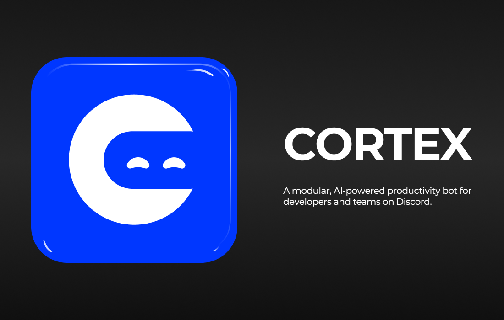

# Cortex

**Cortex** is a modular, productivity-first Discord bot built to streamline developer workflows, automate tasks, and enhance team collaboration within technical communities.

## Overview

Cortex offers a robust set of features, including AI integration, task tracking, note management, daily standups, and personalized utilities — all backed by a scalable PostgreSQL database and modular command architecture. Designed with professional developer communities and technical clubs in mind, Cortex focuses on clarity, customization, and future extensibility.

---

## Features

### AI Assistant

- Seamlessly integrates with Together AI (and optionally xAI) to provide:
  - Code explanations
  - Documentation summarization
  - Standup generation

### Task Manager

- Add, list, and complete tasks using simple slash commands.
- Stores persistent tasks per user using PostgreSQL.
- `/task add` — Add a task
- `/task list` — View pending tasks
- `/task complete` — Mark a task as complete
- `/task finished` — View completed tasks

### Notes

- Store and retrieve quick personal notes.
- Timestamped and ordered by creation date.
- `/note add` — Save a note
- `/note view` — List saved notes
- `/note delete` — Delete note by index

### Daily Standups

- `/standup` command generates a professional daily standup template.
- Tracks submission history and team contributions.

### User Management

- Custom PostgreSQL user service ensures secure and efficient data handling.
- Handles automatic user creation and lookup based on Discord ID.

### Modular Architecture

- Commands are separated into individual files for scalability.
- Services layer cleanly abstracts business logic (e.g., taskService, noteService).
- Fully configurable through `config.json`.

---

## Tech Stack

- **Discord.js** v14 (Interactions API, Slash Commands)
- **Node.js** (ES6+)
- **PostgreSQL** with `pg` library
- **Together AI** (AI Assistant features)

---

## Contribution

Contributions are welcome. Please open issues or submit pull requests for improvements, bug fixes, or feature requests.
If you're contributing new commands or services, please follow the modular structure used for /commands and /services.

## License

This project is licensed under the [MIT License](./LICENSE).
